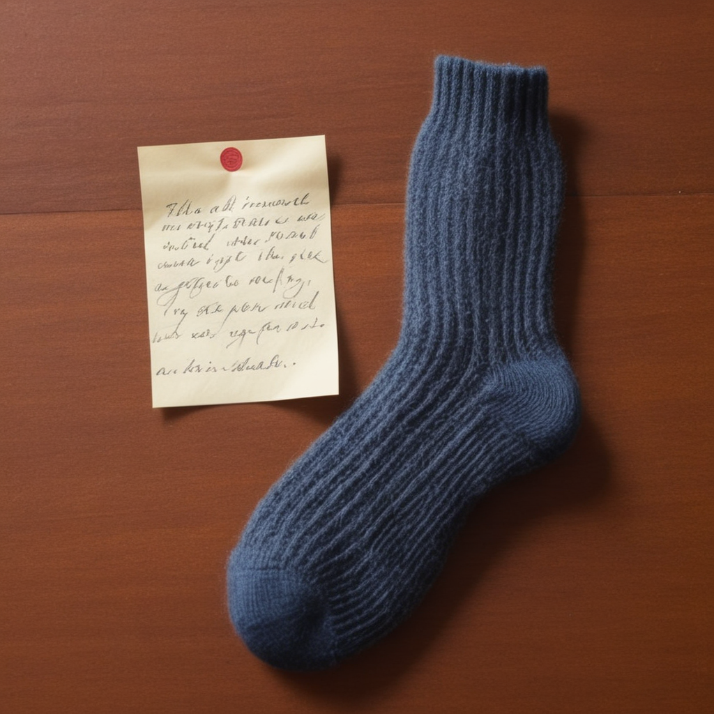

<p align="center">
  
</p>
<h1 align="center">notesock</h1>

Terminal pastebin server utilizing unix sockets, with exact expiry per paste to alleviate filesystem clutter.

It is meant to be used with `netcat`:

```console
$ echo "Hello world" | ncat notesock.example.org 1234
https://notesock.example.org/abc123 | expires in 5m
```
This saves the paste do `/configured/dir/abc123/index.txt` which makes sure that browsers accessing the URL will interpret the file as `.txt` only.
```console
$ curl https://notesock.example.org/abc123
Hello world
``````

The files are stored unencrypted, thus, the user is made responsible to make their information private, e.g. by using `gpg`:
```console
$ echo "My secret paste" | gpg -ca | ncat notesock.example.org 1234
https://notesock.example.org/def456
```

```console
$ curl https://notesock.example.org/def456 | gpg -d
My secret paste
```

## Getting started:

> [!IMPORTANT] 
> Because this server listens on an unix socket, a reverse proxy is necessary if it is supposed to be reachable from the interwebz. (Benefits of this are advanced rate-limiting features of the reverse proxy, with a lean-and-mean backend server that only manages validation, id generation and saving of the pastes.)

### Packages

- Arch User Repository: [notesock](https://aur.archlinux.org/packages/notesock)

### Build

```console
$ git clone https://github.com/Sir-Photch/notesock.git && cd notesock
$ cargo build --release
$ target/release/notesock -h
```
Inspect possible arguments and choose sensible values for your setup.

### Reverse proxy

The same webserver that you would need for serving the pastes via http can be used for this. You just need to forward a network port of your choice to the unix socket created by notesock.
> [!TIP]
> For nginx, you can refer to the [example configuration](/nginx/example.conf).

### systemd

> [!TIP] 
> If you like to use systemd, you can refer to the [example unit](systemd/notesock.service).

### 
